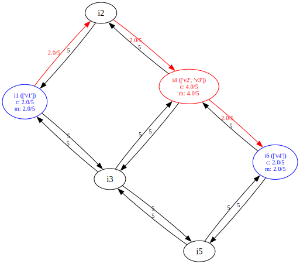

# Energy Price Aware Network Mapping

This is my github repo for the program that maps the SFCs into the physical network.

This is a very simplified model for now but I will increase the number of variables and constraints very soon, and complete the objective function that only takes the energy price into account for now. 

## Example of a simple SFC mapped into a Physical Network graph

The red nodes are used to host VNFs, the red links are used to convey the data flow between VNFs. 

By default, and for now, the first "VNF" is a fictious one and can only be mapped to the first node which is an access node (in blue) and not a server (in red and black). Same goes for the last one. Only the middle VNFs can freely be mapped to the rest of the servers network.

On every used server is written the list of VNFs hosted by this server and the computing/memory resources used and available. On every used physical link is written the bandwidth used and available.

These graphs plots are automatically generated with the help of neato engine from ``graphviz`` python module
