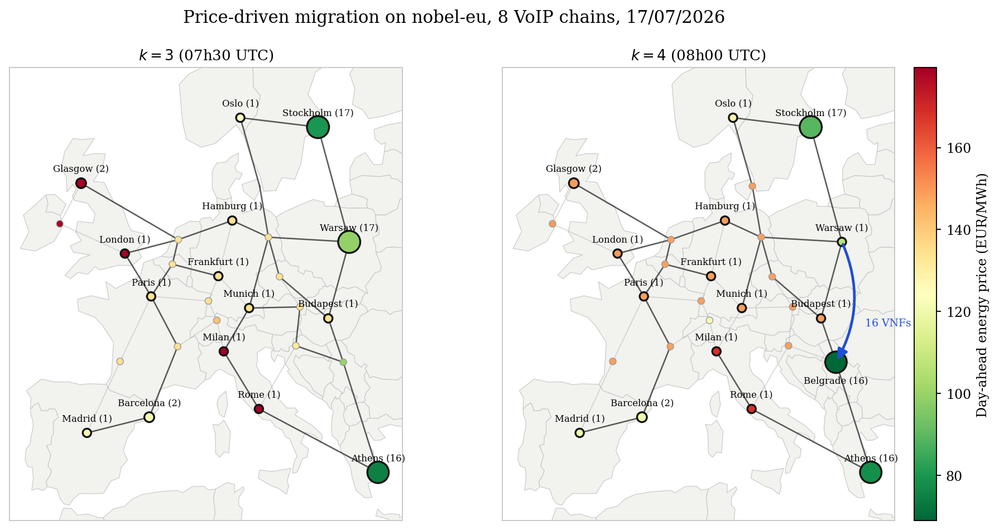
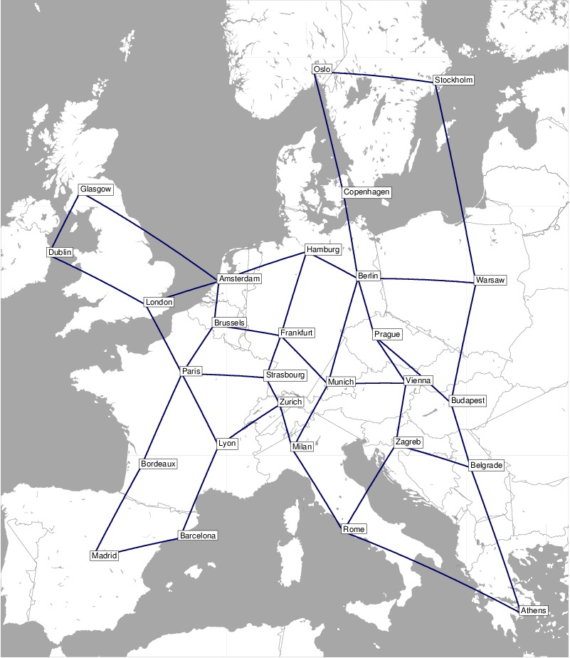
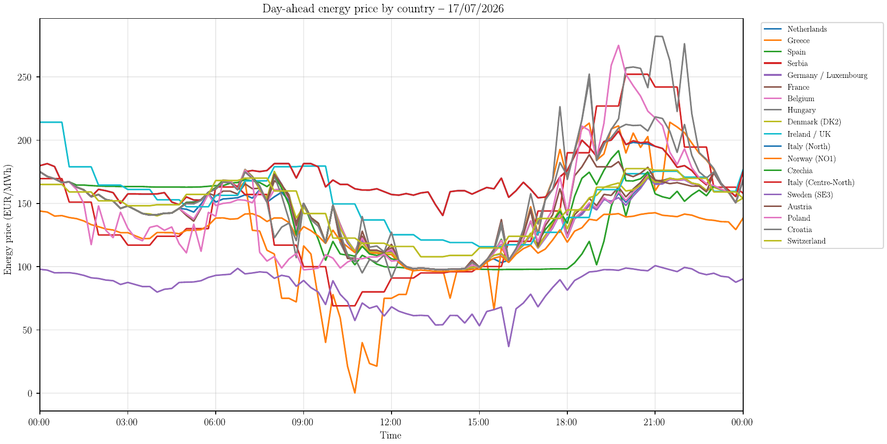
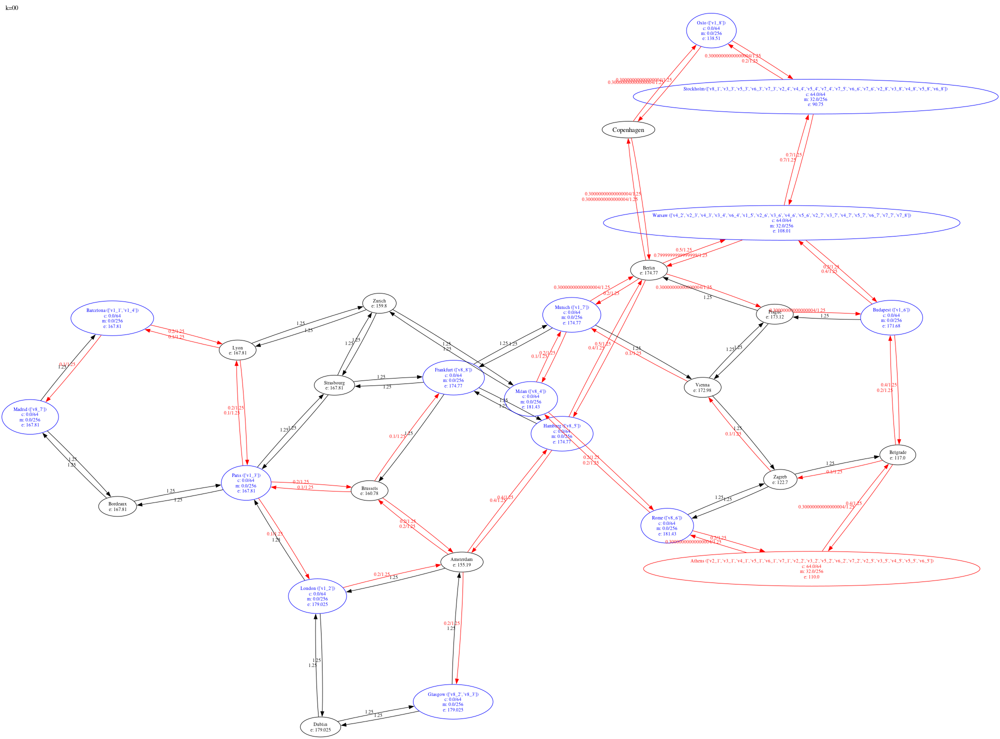
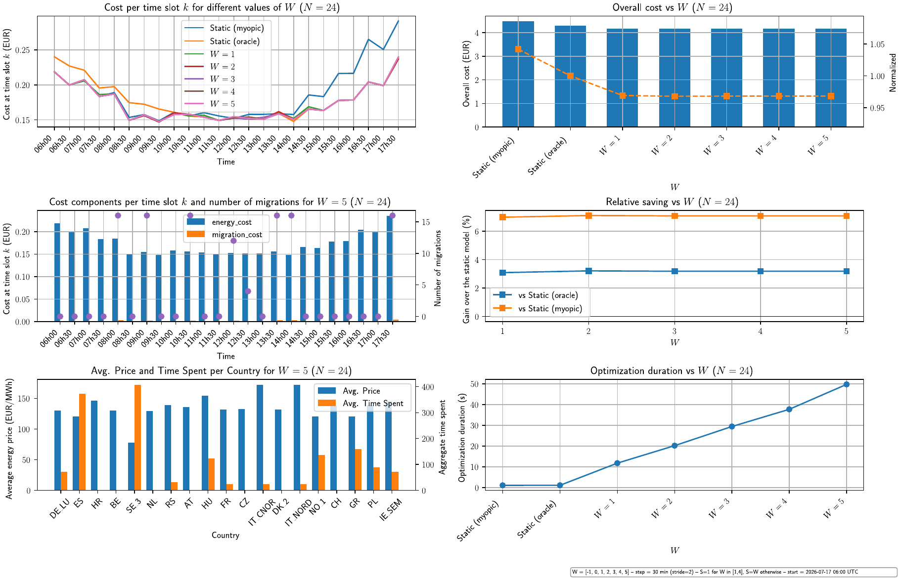
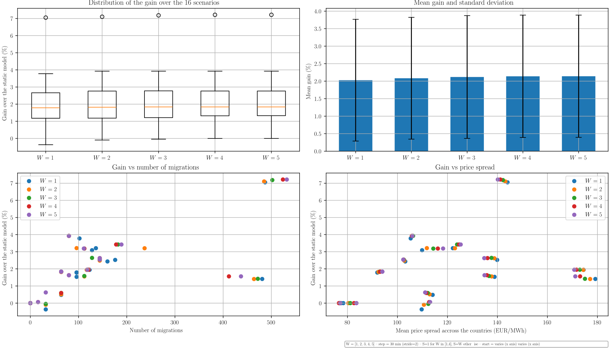

# Energy Price-Aware Management of Virtual Network Functions

Placement and live migration of Virtual Network Functions across a European backbone, driven by day-ahead electricity prices.

The problem is formulated as a Mixed Integer Linear Program and solved in a receding horizon loop with Gurobi. The objective is the electricity bill paid by the Infrastructure Provider, migration energy included, under a latency Service Level Agreement.



One transition of a 24 slot run. At 07h30 many VNFIs are consolidated in Warsaw; half an hour later the Serbian bidding zone is the cheapest of the network and 16 VNF instances move to Belgrade. Node colour is the local day-ahead price, node size the number of VNF instances hosted (access nodes of the chains included), and the dark links are the ones carrying chain traffic.

## Why electricity price needs to be accounted for in the placement decision

Energy accounts for 20 to 40 % of the operational cost of an NFV deployment. In Europe, electricity is traded per bidding zone, and the day-ahead clearing price of two zones can differ by a factor of two or more within the same hour. Network Function Virtualization lets a network function run on any general-purpose server of the infrastructure, so the workload can in principle follow the cheap electricity instead of staying where it was first deployed.

Doing so is not free: moving a VNF costs energy on both the source and the destination server, interrupts the service for a short downtime, and lengthens the path of the chain, which eats into the latency budget. The question this project answers is whether a price-aware dynamic placement still pays off once all of that is accounted for.

| Physical network (nobel-eu, SNDlib) | Day-ahead prices, 17/07/2026 |
| --- | --- |
|  |  |

28 nodes over 19 bidding zones, 41 links, real inter-node distances. Prices are fetched from the ENTSO-E Transparency Platform, one time series per bidding zone.

## Model

**Infrastructure.** Every node of nobel-eu hosts one server (Dell PowerEdge HS5610, 64 cores, 256 GB of RAM, 122 W idle, 602 W at full load). Power draw is interpolated linearly with CPU usage, and each server is billed at the price of its own bidding zone.

**Service.** A VoIP Service Function Chain of 8 VNFs, the first and last being fictitious access nodes pinned to a fixed city, instantiated 8 times over the network. All VNFs share a single flavour of 4 vCPUs and 2 GB of RAM.

**Decision variables**, all binary, one set per time slot `k`:

| Variable | Meaning |
| --- | --- |
| `phi[v][i]` | VNF instance `v` is hosted by node `i` |
| `phi[vw][ij]` | virtual link `vw` is routed over physical link `ij` |
| `sigma[i]` | server `i` is powered on |
| `xi[v][i]` | VNF instance `v` is migrating towards node `i` |

**Constraints.** One host per VNF instance, flow conservation of the virtual links over the physical topology, CPU, memory and bandwidth capacities, migration consistency, and a per-chain latency budget of 150 ms built from 0.5 ms per 100 km of fiber, 50 us per switch hop and 2 ms per hosted VNF.

**Migration cost.** Taken from the live migration measurements of Liu et al. (2011) on the Dbench workload and rescaled to the 2 GB flavour: 2550 MB actually transferred, 42.6 s of migration, 228 ms of downtime and 1326 J, split evenly between source and destination and charged at each local price.

**Objective.** Total cost in euros over the horizon: running cost of the active servers plus migration cost, both weighted by the local and instantaneous electricity price. Every quadratic term of the natural formulation is linearized so the model stays a MILP.

Each solve is exported as a Graphviz drawing of the physical network. Red nodes are servers hosting at least one VNF instance, blue nodes are the access nodes where the chains start and end, and red edges are the physical links carrying at least one virtual link. Each label shows the VNFs hosted, the CPU and memory occupancy, the bandwidth usage and the local energy price. With 8 chains over nobel-eu the drawing gets dense, but it is what one solve actually looks like:



## Solving strategy

The full-horizon problem is NP-hard and out of reach at this scale, so the decision is taken in a receding horizon loop. At each time slot the model looks `W` slots ahead, applies only the first decision, then slides forward and re-optimizes, warm started with the previous solution. Three variants of the look-ahead were implemented:

| Strategy | File | Idea |
| --- | --- | --- |
| 1, single step | `optim_single_step.py` | one set of variables, evaluated against the cumulated cost of the window |
| 2, full window exact | `optim_on_whole_window.py` | all `W` sets of variables, fully binary, optimal for the window |
| 3, full window relaxed | `optim_relaxed.py` | only the applied slot stays binary, the rest is relaxed to [0, 1] |

Strategy 2 produced the results below. At `W = 5` and a load factor of 11 % it already carries about 30 000 binary variables, and roughly 220 000 at a load factor of 75 %, which is where strategies 1 and 3 are meant to take over.

Two static baselines are used for comparison: a naive one that places the chains at `k = 0` and never moves them, and an oracle one that picks the best possible fixed placement knowing the whole price trajectory in advance. The oracle baseline is deliberately given a better forecast than the dynamic model gets, so that any reported gain is not an artifact of the comparison.

## Results

### One run, 24 time slots of 30 minutes, 8 chains



Both static baselines upper bound the dynamic cost at almost every slot. The few exceptions are spikes that line up exactly with the migration peaks of the middle-left panel: the model pays up front for a placement that pays off later. VNFs spend most of their time in the cheapest zones of that day, Sweden and Spain. The dynamic policy saves about 7 % against the naive baseline and 3 % against the oracle one, and the solving time per slot grows linearly with W, staying far below the 30 minutes of a time slot.

### Batch of 90 runs over 13 scenarios

Scenarios vary the starting date, the starting hour and the lifecycle duration one axis at a time, for W from 1 to 5.



| Axis | W = 1 | W = 2 | W = 3 | W = 4 | W = 5 |
| --- | --- | --- | --- | --- | --- |
| **overall gain** | **2.027 %** | **2.083 %** | **2.119 %** | **2.139 %** | **2.141 %** |
| best case | 7.051 % | 7.102 % | 7.183 % | 7.215 % | 7.215 % |
| worst case | -0.367 % | -0.095 % | -0.045 % | 0.000 % | 0.000 % |

Mean gain over the oracle static baseline. Three quarters of the scenarios save more than 1 %, and the gain is positive for every window size on average. The prediction window itself matters less than expected: a longer window improves the optimum of that window, not necessarily on the whole lifecycle, which is why `W = 4` and `W = 5` are not systematically better. The starting date is the main source of uncertainty for the gain, followed by the starting time. Between two starting dates and times, the difference of gain can be huge, so it's necessary to take the mean value over all scenarios. A short lifecycle leaves too few slots for any migration to be worth triggering.

## Interesting files

| Path | Content |
| --- | --- |
| `optim_single_step.py` | strategy 1, single step look-ahead |
| `optim_on_whole_window.py` | strategy 2, exact full window (used for the reported results) |
| `optim_relaxed.py` | strategy 3, LP relaxed full window |
| `simulations.py` | runs one scenario for the baselines and every W, produces the individual figure |
| `simulations_bat.py` | runs the batch over the date, hour, duration and load axes |
| `data_engine.py` | ENTSO-E day-ahead price retrieval, parameter generation, mainly helpers |

## Running it

Requirements :

```bash
pip install gurobipy numpy scipy pandas matplotlib networkx graphviz entsoe-py 
```

Gurobi needs a licence file. Price retrieval needs a personal ENTSO-E Transparency Platform token, read from a file named `api_token` at the root of the repository. Figures are rendered with LaTeX.

Those files should run without further configuration:

```bash
python simulations.py       # one scenario, individual figure
python simulations_bat.py   # full batch, several hours or days
```

However, hyperparameters are to be setup inside the files

## Data and references

Topology and distances from the nobel-eu instance of [SNDlib](http://sndlib.zib.de).

Day-ahead prices from the [ENTSO-E Transparency Platform](https://transparency.entsoe.eu).
